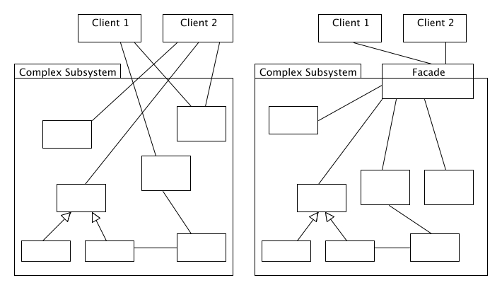

# 퍼사드 패턴

퍼사드는 `건물의 외관`이라는 뜻이다. 그 이름처럼 퍼사드 패턴을 사용함으로써 클라이언트는 복잡한 서브시스템에 대해 쉬운 인터페이스를 제공받고, 서브시스템들과의 결합을 줄인다.

아래 그림은 퍼사드 패턴을 쓰기 전과 후 컴포넌트 간 관계를 나타낸 것이다.

## 퍼사드 패턴의 예시

사실 우리는 알게 모르게 퍼사드 패턴을 많이 쓰고 있다.

- REST API 서비스
- 마이크로서비스 아키텍처에서 복잡한 서비스 호출을 대신해주는 API 게이트웨이

## 참고

http://best-practice-software-engineering.ifs.tuwien.ac.at/patterns/facade.html
