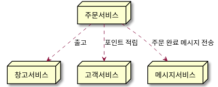
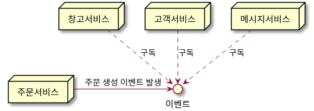

# 마이크로서비스 아키텍처

## 마이크로서비스 아키텍처란?

마이크로서비스 아키텍처는 소프트웨어를 작고 응집된 여러 서비스들로 나누고, 네트워크를 통해 서비스 간 협업을 하도록 만들어 결합을 줄이는 설계 방법이다.

## 마이크로서비스 아키텍처의 장점

거대한 모놀리식 아키텍처와 비교해서 마이크로서비스 아키텍처는 아래와 같은 여러 이점을 가진다.

1. 서비스 별로 독립적인 배포가 가능하다.
2. 서비스 별로 독립적인 확장이 가능하다.
3. 각 서비스마다 기술 선택이 자유롭다.
4. 서비스의 크기가 작기 때문에 변화에 쉽게 대응할 수 있다.
5. 고객이 원하는 대로 서비스를 선택하고 조립할 수 있다.

## 오케스트레이션 vs 코레오그래피

주문 서비스, 창고 서비스, 고객 서비스, 메시지 서비스로 나누어진 마이크로서비스 아키텍처가 있다고 해보자.  
주문 서비스에서 주문이 생성되면 창고 서비스에선 상품이 출고가 되며 고객 서비스에선 포인트 적립을, 메시지 서비스에선 주문 완료 메시지를 전송한다.

이렇게 한 서비스에서 발생한 사건이 여러 서비스의 동작을 발생시켜야 하는 상황을 구현하는 방법은 두가지가 있다.  
`오케스트레이션`과 `코레오그래피`이다.

먼저 `오케스트레이션` 방식은 주문 서비스가 다른 서비스들을 직접 호출하는 방식이다.

`오케스트레이션` 방식에선 다른 서비스 호출에 대한 결과를 알 수 있고 구현이 쉽지만 서비스 간 의존성이 높아진다.

`코레오그래피` 방식은 주문 서비스가 주문이 생성되었다는 이벤트만 내보내고, 나머지 서비스들은 이 이벤트를 구독하는 방식이다.

이 방식은 구현과 모니터링의 복잡도가 증가하지만 서비스 간에 느슨한 결합을 갖게 해준다.

## 사용자 인터페이스

마이크로서비스 아키텍처에선 사용자 인터페이스를 어떻게 설계해야 할지도 고민해봐야 한다.

웹, 모바일 등의 GUI에서 마이크로서비스들의 API를 직접 호출하여 사용한다면 문제가 생긴다.

1. GUI 개발자는 수많은 서비스들의 API를 알고 있어야 한다.
2. 모놀리식 아키텍처였다면 하나의 요청으로 처리될 것이 MSA에서는 여러개의 요청으로 분리되어 성능 저하가 발생한다. (특히 모바일 환경에서)

이런 문제를 해결하기 위해 여러 대안책이 나왔다.

첫번째는 각 서비스를 담당한 팀에서 UI 컴포넌트도 제공하는 방법이다. GUI 개발자는 이런 컴포넌트들을 조합한다.  
하지만 이 방식도 한계가 있다.

1. UI 개발이 여러 팀으로 분리되기 때문에 UI의 일관성 유지가 어렵게 된다.
2. 상호작용하는 컴포넌트들을 만들기 어려워진다.

두번째는 `API 게이트웨이`를 두어 서비스 API들을 추상화(마치 `퍼사드 패턴`처럼)하는 방법이다. 이 방법으로 GUI가 필요로 하는 일부 API만 노출시켜 결합을 줄이고, 여러 서비스 요청들을 하나의 요청으로 묶어주어 성능 이점도 가져다준다.
