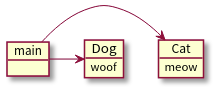
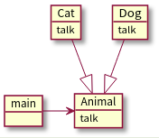



# OOP

## 다형성

객체지향에서 다형성이란 컴포넌트간 의존성을 제어할 수 있게 만드는 힘이다.

```java
class Cat extends Animal {
    String meow() {
        return "Meow!";
    }
}

class Dog extends Animal {
    String woof() {
        return "Woof!";
    }
}

static void main(String[] args) {
    /// ...
    // pet은 Dog일 수도 있고 Cat일 수도 있다.
    if (pat instanceof Cat) {
        pat.meow();
    }
    else if (pat instanceof Dog) {
        pat.woof();
    }
}
```

위 코드는 `main` 함수가 `Cat` 또는 `Dog` 클래스에 의존적이다. 만약 `Cat`의 울음소리가 `yowl`로 바뀐다면 `main` 함수도 같이 수정되어야 한다. 또 동물의 종류가 늘어난다면 마찬가지로 `main`함수를 수정해야한다.

의존 그래프를 그려보면 이런 모습이다.



```java
abstract class Animal {
    abstract String talk();
}

class Cat extends Animal {
    String talk() {
        return "Meow!";
    }
}

class Dog extends Animal {
    String talk() {
        return "Woof!";
    }
}

static void main(String[] args) {
    /// ...
    // pet은 Dog일 수도 있고 Cat일 수도 있다.
    pet.talk();
}
```

위 코드를 보면 `main` 함수는 이제 `Animal` 인터페이스에만 의존하며 `Cat` 또는 `Dog`에는 의존하지 않는다.  
`Animal`의 하위 클래스들이 [리스코프 치환 원칙](https://ko.wikipedia.org/wiki/%EB%A6%AC%EC%8A%A4%EC%BD%94%ED%94%84_%EC%B9%98%ED%99%98_%EC%9B%90%EC%B9%99)을 따른다면 `Cat` 또는 `Dog`이 수정되거나 또 다른 하위 동물 클래스가 생성된다 하더라도 `main`함수는 수정되지 않는다.

이 경우 의존 그래프는 이런 모습이다.



이렇게 의존성을 제어함으로서 `더 중요한 부분`이 `자주 바뀌고 덜 중요한 부분`에 의존하지 않게 만드는 것이다.
