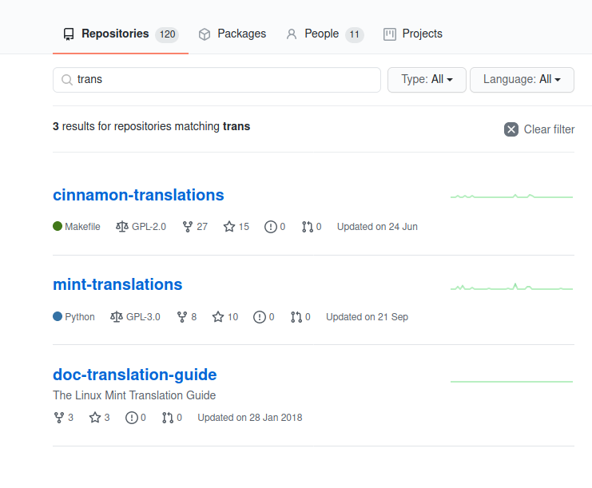

## 리눅스 민트에 컨트리뷰트 할 뻔한 썰

2019년까지는 리눅스 민트 시나몬을 써오다가 회사에서 윈도우 IIS 환경에서 일을 해야하는 상황에 놓어 윈도우로 갈아탔었다. 최근에 그 일이 끝나서 1년만에 리눅스 민트로 다시 돌아왔고, 민트 배포판도 새로 나왔겠다 어제는 밀린 업데이트를 했다.

업데이트를 성공적으로 마치고 날짜를 보려 달력을 클릭했는데 뭔가가 이상했다.

`2020년 10월 30일`로 나와야 하는 텍스트가 `2020년 10월 d일`로 나오는 것이었다.

_버그다._

방에 혼자 있었지만 마치 내가 발견한 보물에 대해서 누가 엿들을까봐 혼자 조용히 중얼거렸다. 코어한 부분은 아니지만 그래도 리눅스 민트에 컨트리뷰트를 할 수 있는 좋은 기회였다.  
언제부터 이 버그가 있었던 걸까. 다른 사람들은 아직 모르는건가? 빨리 알아봐서 고칠 수 있으면 고쳐야겠다. 라는 생각이 들어 바로 움직였다.

우선 날짜 형식이 한글로 나오는 걸 보니 번역이 문제일 수도 있겠다는 가능성에서 시작했다. 언어 설정을 영어로 바꾸고 재부팅을 하고 달력을 다시 봤다. 영어에서는 문제 없이 잘 나왔다. **번역에 문제가 있을 가능성이 더 커졌다**.

리눅스 민트는 오픈 소스이니 번역도 오픈 소스로 하고 있을거라 짐작했다.
리눅스 민트의 [깃헙 팀](https://github.com/linuxmint)를 찾았고 `cinnamon` 저장소에서 관련 이슈가 있는지를 검색해봤지만 나오지 않았다.

그러고는 `translation` 관련 저장소를 찾아봤다.

실제 번역 관련 저장소는 두 개가 나왔는데 둘 중 어느것에 달력 번역이 있는지 몰라서 두 저장소에서 각각 문제의 단어(`d일`)를 검색해보았다.

_찾았다!!_

`%d일`로 되어있어야 하는 것이 `d일`이라 적혀있었다. `git blame`을 봐보니 무려 올해 1월 6일부터 이렇게 되어있었다.

고쳐서 PR을 보내려고 fork를 하려던 순간 README.md를 봐보니 이렇게 적혀있었다.

> Please note the cinnamon-translations GitHub repository is used for packaging purposes only. If you would like to submit translation updates, please see the related Launchpad project at https://translations.launchpad.net/linuxmint/latest/.

아 저기서 하라는 거구나. 하고 들어가서 해당 문장을 봤는데. 오잉??

이곳에서는 번역이 잘 되어있었다. 무슨일인건가 했더니 어떤 분께서 1월 9일(번역이 잘못 업데이트 된지 3일만)에 수정해주셨는데 다른 사람의 리뷰를 받아야 승인이 되는 옵션을 켜셨던 것 같다.  
그런데 그 리뷰가 9월에 돼서야 받아진 거였다. 아까 위에서 봤던 `cinnamon-translation` 저장소에서 가장 최근 업데이트가 6월이었으니 단순히 아직 업데이트가 안된걸로 보인다.

아쉽게도 리눅스 민트에 컨트리뷰트를 하진 못했다. 그래도 덕분에 오늘 하루가 지루하진 않았고 별개 얘기로 **시나몬 코드의 무려 40%가 `javascript`로 작성되어있다는 사실**을 알게 되었다.  
([CJS](https://github.com/linuxmint/cjs)라는 Cinnamon Javascript 인터프리터를 사용한다는데 아직은 잘 모르겠다.)

무튼 **리눅스 민트에 컨트리뷰트 할 뻔한 썰**을 **뻘짓들** 첫 스토리로 이렇게 올리게 된다.
